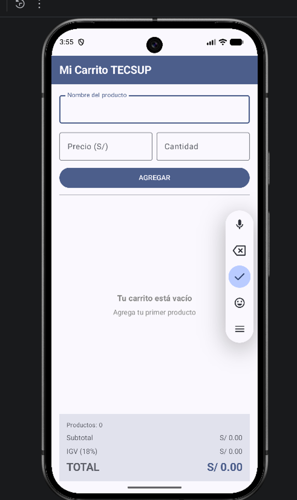
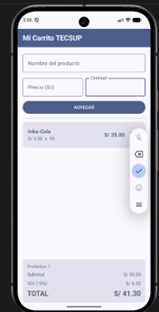

# Laboratorio 04 - Mi Carrito TECSUP

## Autor

Carlos Andia

## Descripción

Aplicación móvil desarrollada en Kotlin utilizando Jetpack Compose. Permite registrar productos indicando su nombre, precio y cantidad, mostrarlos dentro de una lista dinámica y eliminarlos mediante un botón.

La aplicación calcula automáticamente el subtotal, el IGV del 18% y el total del carrito.

## Funcionalidades

- Registro del nombre del producto.
- Registro del precio y cantidad.
- Validación de campos antes de agregar.
- Lista dinámica de productos con `LazyColumn`.
- Tarjetas individuales mediante `TarjetaProducto`.
- Cálculo del importe por producto.
- Eliminación de productos.
- Cálculo automático del subtotal.
- Cálculo del IGV del 18%.
- Cálculo del total.
- Estado vacío centrado mediante `Box`.
- Panel de totales fijo en la parte inferior.

## Capturas de la aplicación

### Estado vacío



### Carrito con productos



## Preguntas conceptuales

### 1. ¿Por qué se utiliza `mutableStateListOf` y no una `MutableList` normal?

Se utiliza `mutableStateListOf` porque es una lista observable por Jetpack Compose. Cuando se agrega o elimina un producto, Compose detecta el cambio y actualiza automáticamente los elementos mostrados en la pantalla.

Una `MutableList` normal permite modificar sus elementos, pero Compose no detecta automáticamente esos cambios y la interfaz podría no actualizarse.

### 2. ¿Por qué la lista se declara con `val` si podemos agregarle elementos?

La variable se declara con `val` porque la referencia a la lista no será reemplazada por otra lista. Sin embargo, el contenido del objeto continúa siendo mutable.

Por eso podemos utilizar operaciones como:

```kotlin
productos.add(producto)
productos.remove(producto)